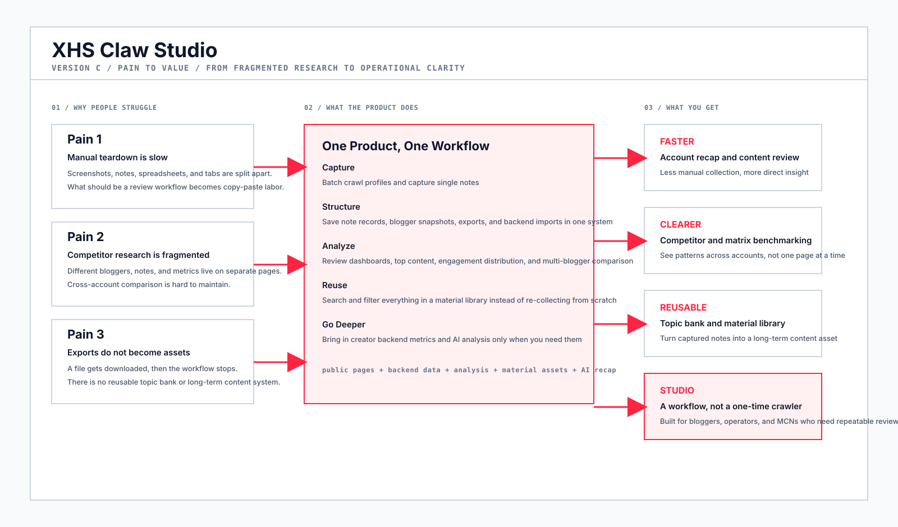
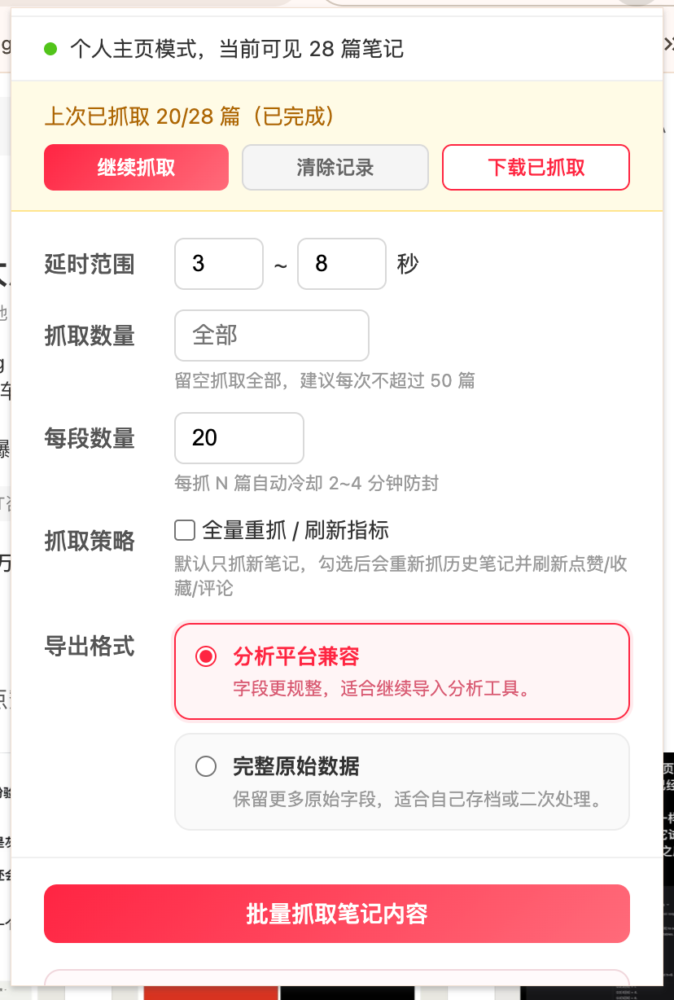
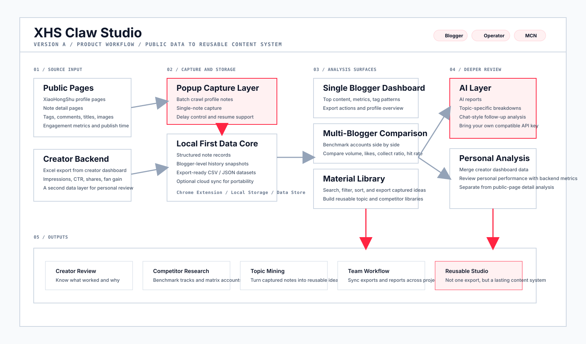
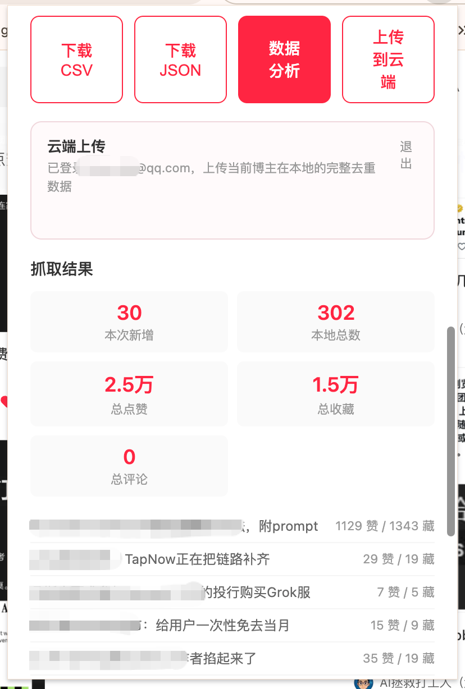
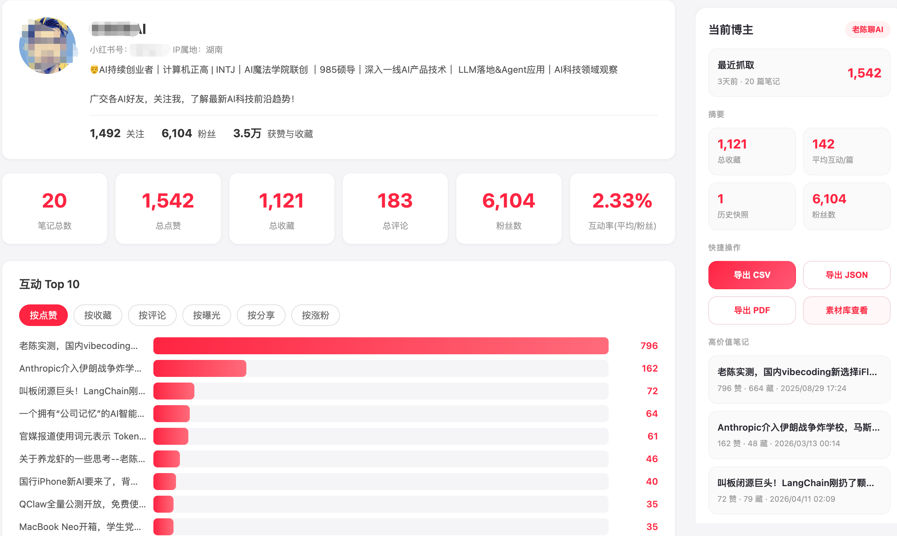
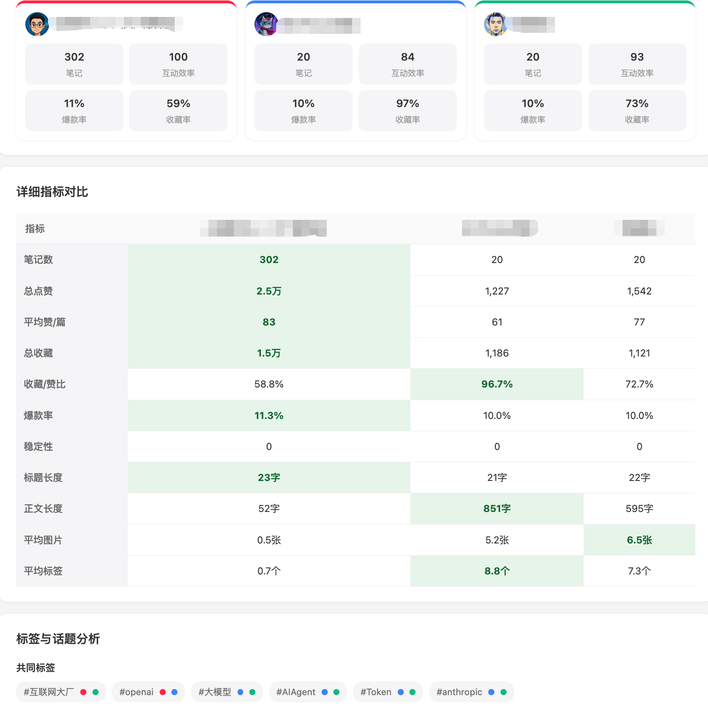
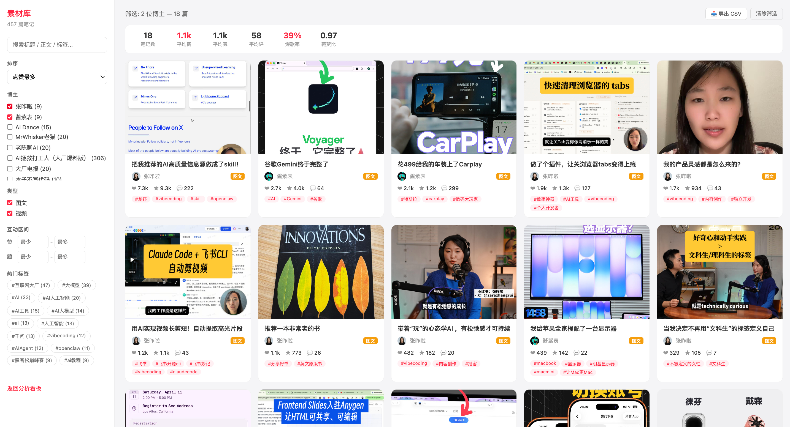
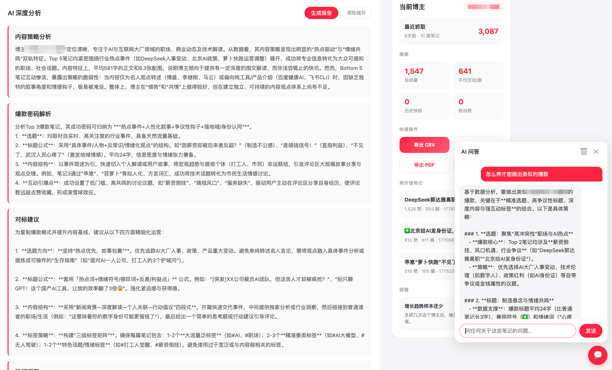
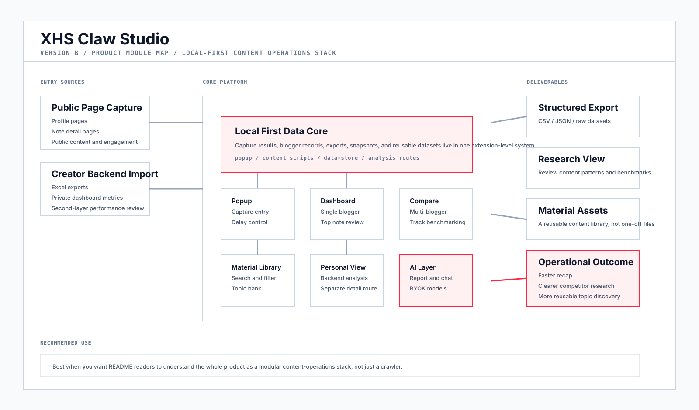

# xhs-claw-studio

  

  <strong>Turn XiaoHongShu from manual scrolling, copying, and comparing into a structured content studio.</strong>

  <a href="./README.md">中文 README</a>

  
  
  

## ✨ Why This Exists

For bloggers, operators, and MCNs, the hard part is rarely just "reading content."

The real friction usually looks like this:

- breakout-post teardown still depends on screenshots and manual spreadsheets
- competitor and matrix-account research lives across too many scattered pages
- exported data stops at a sheet instead of turning into reusable review workflows
- public-page data and creator-dashboard data stay disconnected, so analysis breaks halfway through

`xhs-claw-studio` was built for exactly that workflow.

It connects public-page capture, export, analysis, material-library workflows, and creator-dashboard import into one pipeline, so you do not have to bounce between screenshots, spreadsheets, tabs, and scattered notes.

### 🧭 Diagram: Pain to Value

It currently supports:

- batch capture from XiaoHongShu profile pages
- single-note capture from note detail pages
- CSV / JSON export
- blogger analysis dashboard
- multi-blogger comparison
- searchable material library
- creator dashboard Excel import
- AI reports and follow-up chat
- optional cloud sync

### 🖼️ Screenshot 1: Popup / Batch Capture Entry

Description:
After loading the extension into Chrome, open any XiaoHongShu profile page and use the popup to batch-capture notes. It is recommended to control delay settings and batch size to reduce anti-bot risk. If capture fails, open `F12`, inspect `Network`, and submit an issue with the relevant request details.

## 🎯 What It Solves

The point is not just to capture content. The point is to keep using it after capture.

It turns public XiaoHongShu pages into structured data, then continues into analysis, recap, comparison, and reusable content research workflows instead of stopping at a one-time export.

Typical use cases:

- content ops review
- competitor research
- topic and idea mining
- content archiving
- creator account analysis

## 🧭 Current Real Workflow

1. Open a XiaoHongShu profile page or note detail page
2. Capture a single note or batch-crawl a profile
3. Export CSV / JSON or jump directly into the analysis dashboard
4. Review top content, engagement distribution, tag strategy, and multi-blogger comparison
5. Search, filter, and export captured content from the material library
6. Import creator dashboard Excel files for deeper personal analysis
7. If you configure your own compatible API key, continue with AI reports and AI chat

### 🗺️ Diagram: Product Workflow

## 🧩 Core Features

### 1. Data Capture 📥

- batch capture from XiaoHongShu profile pages
- single-note capture from note detail pages
- extract title, body, tags, images, comments, engagement metrics, publish time, and source URL
- resume support for interrupted runs
- cooldown-based pacing to reduce failures during longer crawls

### 🖼️ Screenshot 2: Capture Results and Next Actions

Description:
After a batch capture finishes, you can directly download `CSV` or `JSON`, jump into the `Data Analysis` dashboard, or upload the current blogger dataset to the cloud to form a continuous workflow from capture to analysis.

### 2. Data Export 📦

- CSV export
- JSON export
- standard analysis export
- full raw-data export

### 3. Analysis Dashboard 📊

- single-blogger analysis
- top-content ranking
- engagement distribution
- tag and title pattern analysis
- multi-blogger comparison
- personal analysis after creator dashboard import

### 🖼️ Screenshot 3: Single Blogger Dashboard

Description:
Inside the analysis page, you can review a blogger's core metrics, top-performing content, profile details, and export actions. This view works well for account review, content breakdown, and periodic performance checks.

### 🖼️ Screenshot 4: Multi-Blogger Comparison

Description:
Compare multiple bloggers side by side across note count, total likes, average likes per post, collect-to-like ratio, breakout rate, title length, body length, and more. This is useful for competitor research and same-track benchmarking.

### 4. Material Library 🗂️

- unified cross-blogger search
- search by title, body, tag, or blogger
- filter by content type, engagement range, and tags
- expand note details
- export filtered results

### 🖼️ Screenshot 5: Material Library

Description:
Captured data is accumulated into a reusable material library with search, filtering, sorting, and export. It is useful for building long-term topic banks, breakout-post libraries, and competitor inspiration databases.

### 5. AI 🤖

- BYOK by default, no model usage subsidy included
- supports DeepSeek, OpenAI, Moonshot, GLM, Qwen, and SiliconFlow
- custom model names supported

### 🖼️ Screenshot 6: AI Deep Analysis and Chat

Description:
Supports broad analysis, chat-style exploration, and focused analysis around specific topics. LLM capability is already integrated, but you need to configure your own compatible API key to use it.

## 🚀 Installation

The current recommended install method is Chrome developer mode:

1. Clone or download this repository
2. Open `chrome://extensions/`
3. Enable `Developer mode`
4. Click `Load unpacked`
5. Select this project directory

If you download the packaged ZIP from `dist/`, unzip it first and then select the extracted folder. Chrome developer mode does not load a ZIP file directly through `Load unpacked`.

## 🧱 Product Module Map

